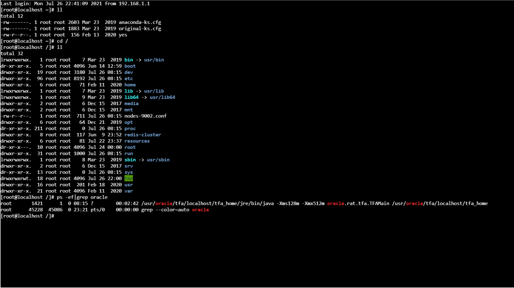
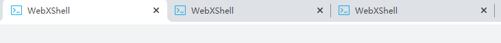

##WebXShell V1.0

网页版XShell <br>

````
1.支持大部分指令
2.支持多客户端访问
3.页面简陋,测试Demo
````

> 访问路径: http://localhost/shell/index
> 
> 

<table>
    <thead>
        <th>支持的快捷键</th>
        <th>功能说明</th>
    </thead>
    <tr>
        <td>Tab</td>
        <td>命令自动补全</td>
    </tr>
    <tr>
        <td>Enter</td>
        <td>执行命令</td>
    </tr>
    <tr>
        <td>Backspace</td>
        <td>向前删除</td>
    </tr>
    <tr>
        <td>Delete</td>
        <td>向后删除</td>
    </tr>
    <tr>
        <td>↑</td>
        <td>上翻历史命令</td>
    </tr>
    <tr>
        <td>↓</td>
        <td>下翻历史命令</td>
    </tr>
    <tr>
        <td>←</td>
        <td>光标左移</td>
    </tr>
    <tr>
        <td>→</td>
        <td>光标右移</td>
    </tr>
    <tr>
        <td>Ctrl+L</td>
        <td>清屏</td>
    </tr>
    <tr>
        <td>Ctrl+C</td>
        <td>中断执行的命令</td>
    </tr>
    <tr>
        <td>Ctrl+Insert</td>
        <td>复制</td>
    </tr>
    <tr>
        <td>Shift+Insert</td>
        <td>粘贴</td>
    </tr>
    <tr>
        <td>Alt+Insert</td>
        <td>粘贴选中内容</td>
    </tr>
    <tr>
        <td>Ctrl+Shift+B</td>
        <td>滚动缓冲区清除</td>
    </tr>
</table>

**前端页面使用xterm.js + sockjs.js + stomp.js <br>
后端使用Springboot + WebSocket + Jsch**

>1.GitHub地址: https://github.com/xtermjs/xterm.js

>2.不同Tag版本: https://github.com/xtermjs/xterm.js/tags
 
>3.推荐网站:https://unpkg.com,可以直接获取指定版本号的js文件<br>
    例如:https://unpkg.com/xterm@4.13.0/lib/xterm.js
